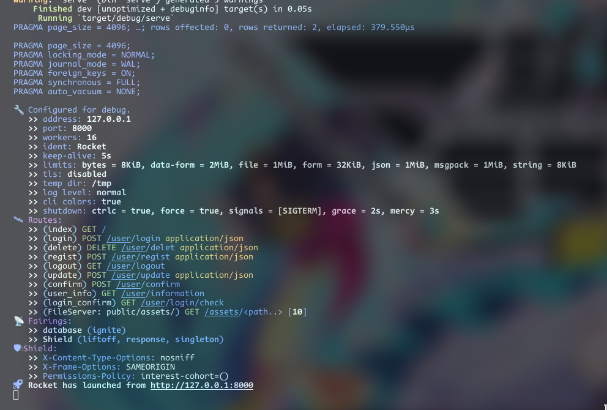
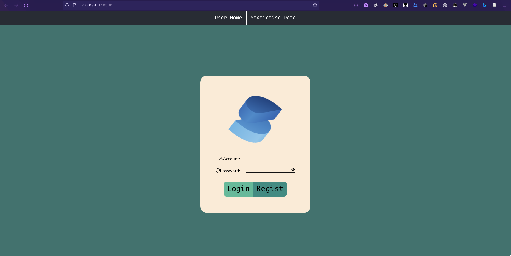
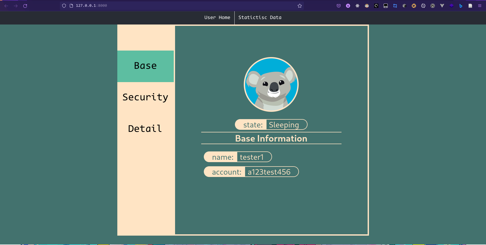

# ponydoor
一个简单的门户系统

## 功能

- 用户管理
  - 注册
  - 登陆
  - 注销
- 数据统计
  - 用户数量
  - 登陆频次
  - TODO
- 用户信息修改
  - 基本信息
    - 昵称
    - 头像
    - 状态
  - 安全
    - 邮箱（需要密码确认)
    - 其他联系方式
    - 密码
    - 密保问题（需要密码确认)
  - 详细信息
    - 简介
    - 地区
    - 生日
    - 血型
    - TODO

TODO

## 使用方法
确保安装了`Rust` nightly 版本编译器 `Cargo` 以及 `npm` 包管理器

然后打开终端(建议在 Linux 操作系统下使用)
```
$git clone https://github.com/XaydBayeck/ponydoor.git

$cd ponydoor/fronted

$npm i

$npm run build

$cd ../serve

$cargo run
```

你也许会看到:


这说明服务器已经启动,打开浏览器地址栏输入`http://localhost:8000`按下回车
你会看到:


注册登陆以后你会看到:


